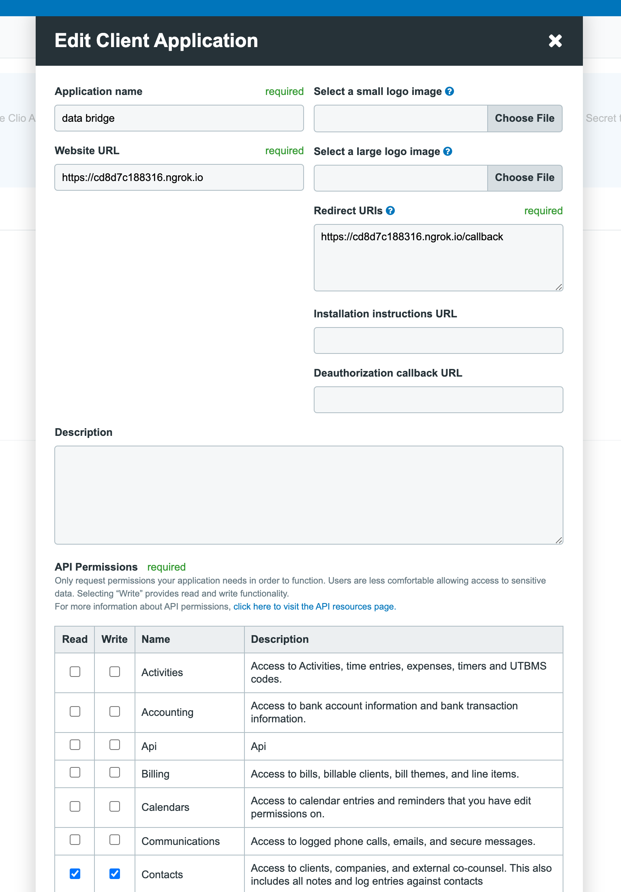
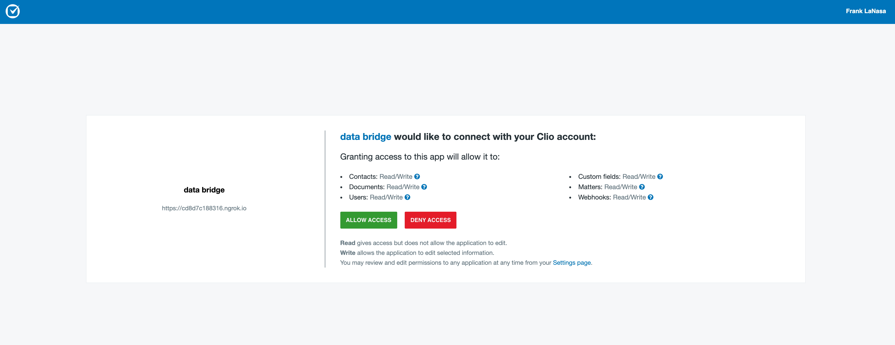

# Data Bridge Documentation

## Components
### [web](web/Dockerfile)
A container configured to run a Flask app used to handle authentication with the [Clio API](https://app.clio.com/api/v4/documentation)

### [job](job/Dockerfile)
A contianer configured to run python scripts pulling and pushing data from GIS and Clio

### [utils](/utils/)
Wrappers for interacting with the GIS API, Clio API, and a `DataBridge` class responsible for pulling, saving, and pushing data between the two services.

## Data Directory Layout
Where the programs store authentication keys, Clio resources, and data to be processed
```
BASE_DATA_DIR/
    auth/
        access
        refresh
    data/
        clio/
            client.json
            group.json
            practice_area.json
            custom_fields.json
            log
            queued/
                matters/
                    2021-07-01T10:10:10
                    ...
                notes/
                    2021-07-01T10:10:10
                    ...
        gis/
            log
            queued/
                active_litigations/
                    2021-07-01T10:10:10
                    ...
                attachments/
                    2021-07-01T10:10:10
                    ...

```

## Environment Variables
```
CLIO_API_KEY=
CLIO_API_SECRET=
BASE_DATA_DIR=/data-dir
FLASK_APP=app
```

## Workflow
1. Log in to [Clio developer hub](https://www.clio.com/partnerships/developers/), create application, and set app url and authorization callback url. Need read and write permissions for the following models:
- Matters
- Contacts
- Calendars
- Custom Fields
- Documents
- Users
  


1. Build Docker images
```
docker-compose build
```
3. Run web server

```
docker-compose run web
```
4. Authenticate. Have someone with Clio access visit `domain.com/auth`. We will [redirect them](/web/app.py#L10) to an authentication url where they can authorize the application.
   


When the user authenticates the app, Clio will redirect them to our callback URL and we will save the access and refresh token in the `auth` directory. The [`AuthClient`](/utils/clio_client.py#L57) should automatically pull a new access token using the refresh token when it expires. 

See the Clio [documentation](https://app.clio.com/api/v4/documentation#section/Authorization-with-OAuth-2.0) and the Requests-OAuthlib library's [documentation](https://requests-oauthlib.readthedocs.io/en/latest/) for more information about authentication.

Once these tokens are saved, the web app can be shut down.

5. Bootstrap Clio Client
```
docker-compose run job python -m bootstrap
```
We interact with a number of resources that should remain static once they are created.

- [Group](https://app.clio.com/api/v4/documentation#tag/Groups): controls which Clio users can access which Clio Matters (the equivalent of a GIS active litigation)
- [Client](https://app.clio.com/api/v4/documentation#tag/Contacts): a contact which is associated with a matter
- [Practice Area](https://app.clio.com/api/v4/documentation#tag/Practice-Areas): a way to filter matter
- [Custom Fields](https://app.clio.com/api/v4/documentation#tag/Custom-Fields): custom data associated with Clio Matters

This script will look for the presence of these resouces matching the names defined in [utils/constants.py](utils/constants.py), create them if necessary, and save them to json files in `/data/clio/`.

6. Migrate data from GIS to Clio

```
docker-compose run job python -m migrate
```
This essentially just runs the `pull_gis_updates` and `push_gis_updates` scripts consecutively with a few small modifications. After running these scripts, we will also set the "last pull time" for Clio updates to the current time so we only start pulling updates after the initial migration.

7. Set up each script to run periodically
- [`pull_gis_updates`](#pull_gis_updates)
- [`push_gis_updates`](#push_gis_updates)
- [`pull_clio_updates`](#pull_clio_updates)
- [`push_clio_updates`](#push_clio_updates)

## Scripts

### `pull_gis_updates`
1. Fetch all active litigations. In subsequent runs, we will only fetch those updated since the last pull. 
2. Save them to `data/gis/queued/active_litigations/{current_time_iso_date_string}`
3. For each litigation, get the information for all of its attachments. There is no way to tell which attachments were updated since the last pull, so we will have to check for a corresponding Clio document when pushing on subsequent runs.
4. Save these to `data/gis/queued/attatchments/{current_time_iso_date_string}`
5. Save the time of the pull (the previously referenced `{current_time_iso_date_string}`) to `data/gis/log`

### `push_gis_updates`
1. For each file in `data/gis/queued/active_litigations`, loop through litigations and create or update a [Clio matter](https://app.clio.com/api/v4/documentation#tag/Matters) (automatically creates on migrate). During the initial migration, we will also create a Clio note using the value of the GIS feature's `BoardUp_Notes` field. If we fail to process any `active_litigations`, we will re-save the failed litigations to the queue (using the same filename). If we process all successfully, we delete the file.
2. For each file in `data/gis/queued/attachments`, loop through attachments, check for the existence of a [Clio document](https://app.clio.com/api/v4/documentation#tag/Document) using the incident's civil warrant number (saved on the Clio Document), and create a new document if it does not exist. We skip checking for the existence of the document during the initial migration. If we fail to process any `active_litigations`, we will re-save the failed litigations to the queue (using the same filename). If we process all successfully, we delete the file.

### `pull_clio_updates`
1. Fetch all matters and select those updated since the last run. (We need to pull all matters because notes (see below) pulled using an associated matter id, and matters are not marked as updated when a note is added. Therefore, we have to check for udpated notes for all matters.) Save these to `data/clio/queued/matters/{current_time_iso_date_string}`.
2. For each matter, find all associated notes updated since the last Clio pull. Save these to `data/clio/queued/notes/{current_time_iso_date_string}`
3. Save the time of the pull (the previously referenced `{current_time_iso_date_string}`) to `data/clio/log`

### `push_clio_updates`
1. For each file in `data/clio/queued/matters`, loop through matters and update the associated GIS litigation fields:
- `NextCourtDate`
- `Court_Status`

If we fail to process any `active_litigations`, we will re-save the failed litigations to the queue (using the same filename). If we process all successfully, we delete the file.

2. For each file in `data/clio/queued/matters`, loop through notes and update the associated GIS litigation's `BoardUp_Notes` field. If we fail to process any `active_litigations`, we will re-save the failed litigations to the queue (using the same filename). If we process all successfully, we delete the file.